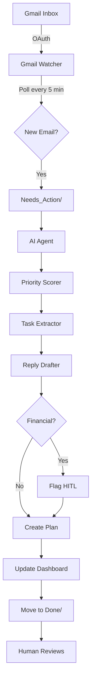

# Personal AI Employee Hackathon Project

Current phase: Silver Tier (building on Bronze foundation)  
Project root: Bronze-Tier/ (will rename to Hackathon-0 or similar after Platinum)


# 🤖 AI Employee Vault - Bronze Tier

> **Personal AI Employee Hackathon 0 – Building Autonomous FTEs in 2026**

An autonomous email processing system that monitors Gmail, applies intelligent priority scoring, extracts tasks, creates action plans, and flags sensitive operations for human approval using the Ralph Wiggum pattern (ACT → INFORM → WAIT).

[](https://www.python.org/downloads/)
[](https://opensource.org/licenses/MIT)
[](https://github.com/AnamShergill/Hackathon_0-Bronze-Tier)

---

## 🎯 What It Does

The AI Employee Vault autonomously:
- 📧 Monitors your Gmail inbox for important/starred emails
- 🎯 Scores priority (HIGH/MEDIUM/LOW/IGNORE) based on keywords
- 📝 Extracts tasks, deadlines, and people mentioned
- 📋 Creates actionable plans with checklists
- ✍️ Drafts professional reply emails
- ⚠️ Flags financial transactions for human approval
- 📊 Updates a live dashboard with activity logs
- ✅ Follows strict rules defined in Company Handbook

**No emails are sent automatically** - all replies require human approval (Bronze Tier safety feature).

---

## 🏗️ Architecture



---

## ✨ Features

### Bronze Tier Achievements ✅

- ✅ **Gmail Watcher** - OAuth authentication, polls every 5 minutes
- ✅ **Priority Scoring** - Keyword-based urgency detection
- ✅ **Task Extraction** - Automatic action item identification
- ✅ **Reply Drafting** - Professional email responses
- ✅ **HITL Protection** - Financial operations require approval
- ✅ **Dashboard** - Live system status and activity logs
- ✅ **Ralph Wiggum Loop** - ACT → INFORM → WAIT autonomy pattern
- ✅ **Folder Workflow** - Needs_Action → Plans → Done pipeline

### Security & Privacy

- 🔒 OAuth 2.0 authentication (no password storage)
- 🔒 Local data storage only (no external APIs except Gmail)
- 🔒 Read-only Gmail scope (cannot send emails)
- 🔒 Automatic HITL flags for financial keywords
- 🔒 All sensitive files in .gitignore

---

## 🚀 Quick Start

### Prerequisites

- Python 3.13+
- Gmail account
- Google Cloud Project with Gmail API enabled

### Installation

1. **Clone the repository:**
```bash
git clone https://github.com/AnamShergill/Hackathon_0-Bronze-Tier.git
cd Hackathon_0-Bronze-Tier
```

2. **Install dependencies:**
```bash
pip install google-api-python-client google-auth-oauthlib google-auth-httplib2 watchdog python-dotenv playwright pyyaml
```

3. **Set up Gmail API:**
   - Go to [Google Cloud Console](https://console.cloud.google.com)
   - Create a new project
   - Enable Gmail API
   - Create OAuth 2.0 credentials
   - Download as `credentials.json` and place in project root

4. **Start the Gmail Watcher:**
```bash
python Watchers/gmail_watcher.py
```
   - Browser opens for OAuth (first run only)
   - Polls Gmail every 5 minutes
   - Creates `.md` files in `Needs_Action/`

5. **Process emails:**
```bash
python Skills/email_processor.py
```
   - Applies priority scoring
   - Extracts tasks and deadlines
   - Creates plans in `Plans/`
   - Drafts replies (requires approval)
   - Moves processed emails to `Done/`

6. **Check the dashboard:**
```bash
cat Dashboard.md
```

---

## 📁 Project Structure

```
AI_Employee_Vault/
├── Needs_Action/          # Incoming emails from watcher
├── Plans/                 # Action plans and draft replies
├── Done/                  # Processed emails with <COMPLETE> markers
├── Pending_Approval/      # Items awaiting human approval
├── Approved/              # Human-approved items
├── Skills/                # Agent skill definitions
│   ├── 01_EMAIL_PROCESSOR.md
│   ├── 02_EMAIL_REPLY_DRAFTER.md
│   ├── 03_TASK_EXTRACTOR.md
│   ├── 04_PRIORITY_SCORER.md
│   ├── 05_DASHBOARD_UPDATER.md
│   ├── 06_ARCHIVE_CLEANER.md
│   └── email_processor.py
├── Watchers/              # External system monitors
│   ├── gmail_watcher.py
│   └── base_watcher.py
├── Dashboard.md           # Live system status
├── Company_Handbook.md    # Rules of engagement
├── CLAUDE.md              # AI agent system prompt
├── demo_guide.md          # Comprehensive demo guide
├── TROUBLESHOOTING.md     # Debug guide
└── orchestrator.py        # Main coordination script
```

---

## 🧪 Testing

### Send a Test Email

1. Send email to yourself with:
   - Subject: `URGENT: Payment Due $500`
   - Body: `Please process this payment by tomorrow.`

2. In Gmail:
   - DON'T open it (keep unread)
   - Click the star icon ⭐

3. Wait up to 5 minutes for watcher to detect

4. Run processor:
```bash
python Skills/email_processor.py
```

5. Check results:
```bash
ls Plans/          # Action plan created
ls Done/           # Email moved here
cat Dashboard.md   # Updated with activity
```

---

## 📊 Priority Scoring

The system automatically assigns priorities:

| Priority | Triggers | Example |
|----------|----------|---------|
| **HIGH** | Urgent keywords + $ amounts + deadlines | "URGENT: Invoice $500 due tomorrow" |
| **MEDIUM** | Questions, requests, updates | "Can you send me the report?" |
| **LOW** | Informational, confirmations | "Your order has shipped" |
| **IGNORE** | Promotional, no-reply senders | "Newsletter: Weekly deals" |

---

## 🛡️ HITL (Human-In-The-Loop) Protection

Per `Company_Handbook.md`, these operations require human approval:

✅ **Auto-approve:**
- Reading emails
- Creating plans
- Updating dashboard

⚠️ **Require approval:**
- Financial transactions ($, €, £, payment, invoice)
- Sending emails with attachments
- Adding new recipients (CC/BCC)

Example HITL flag:
```yaml
requires_hitl: true
hitl_reason: "Financial transaction ($500) requires human approval"
```

---

## 🔧 Troubleshooting

### Watcher Not Finding Emails?

**Check:**
1. Email is **unread** (bold in Gmail)
2. Email is **starred** (yellow star icon)
3. Email is in **Inbox** (not Sent/Spam)
4. Email is **recent** (last 24 hours)

**Debug:**
```bash
python debug_gmail.py
```

See [TROUBLESHOOTING.md](TROUBLESHOOTING.md) for detailed guide.

---

## 📚 Documentation

- [demo_guide.md](demo_guide.md) - Comprehensive demo and usage guide
- [TROUBLESHOOTING.md](TROUBLESHOOTING.md) - Debug and fix common issues
- [Company_Handbook.md](Company_Handbook.md) - Rules and authorization levels
- [CLAUDE.md](CLAUDE.md) - AI agent system prompt

---

## 🎓 Lessons Learned

### What Worked Well ✅
- Structured markdown files with YAML frontmatter
- Ralph Wiggum pattern for clear autonomy boundaries
- Keyword-based priority scoring (no ML needed)
- Folder-based workflow (simple and debuggable)
- HITL flags for financial operations

### Challenges ⚠️
- HTML email content extraction
- Gmail's 24-hour query limitation
- No automatic email sending (by design)
- Manual loop execution required

### Key Insights 💡
- Autonomy requires constraints (HITL approval builds trust)
- Transparency is critical (dashboard + activity logs)
- Simple > Complex (files easier than database)
- Security first (limited OAuth scopes)

---

## 🚀 Future Roadmap

### Silver Tier (Next)
- 📱 WhatsApp Business API watcher
- 📧 MCP email sender with approval workflow
- 🔄 Automatic loop trigger on new files
- 🧵 Conversation threading

### Gold Tier (Future)
- 🌐 Multi-channel (Slack, Discord, Telegram)
- 🧠 Advanced NLP (sentiment, entity extraction)
- 📅 Calendar integration
- 💳 Payment processing with HITL

### Platinum Tier (Vision)
- 🤝 Team collaboration
- 📱 Mobile app
- 🎤 Voice interface
- 🔮 Proactive suggestions

---

## 🤝 Contributing

This is a hackathon project demonstrating Bronze Tier capabilities. Contributions welcome!

1. Fork the repository
2. Create a feature branch (`git checkout -b feature/amazing-feature`)
3. Commit your changes (`git commit -m 'Add amazing feature'`)
4. Push to the branch (`git push origin feature/amazing-feature`)
5. Open a Pull Request

---

## 📄 License

MIT License - See [LICENSE](LICENSE) file for details

---

## 🙏 Acknowledgments

Built for **Personal AI Employee Hackathon 0 – Building Autonomous FTEs in 2026**

Special thanks to:
- Google Gmail API team
- Python community
- Claude AI for development assistance

---

## 📞 Contact

**Anam Shergill**
- GitHub: [@AnamShergill](https://github.com/AnamShergill)
- Project: [Hackathon_0-Bronze-Tier](https://github.com/AnamShergill/Hackathon_0-Bronze-Tier)

---

## 🏆 Achievement Unlocked

**Bronze Tier Complete** ✅
- Folder structure ✓
- Core markdown files ✓
- Python project + dependencies ✓
- Gmail Watcher running ✓
- Agent skills created ✓
- Ralph Wiggum loop functional ✓

**Ready for Silver Tier!** 🚀

---

**Last Updated:** March 18, 2026  
**Version:** Bronze Tier v1.0  
**Status:** Production Ready
