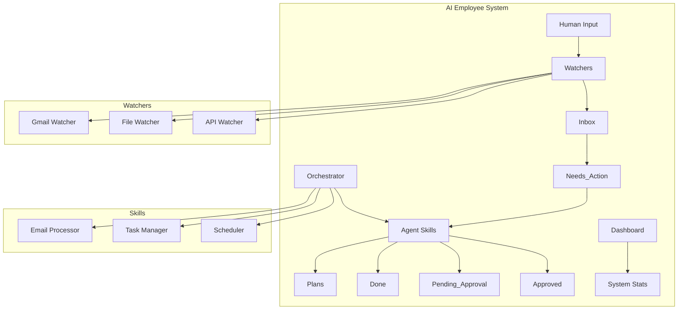

# AI Employee Vault - Bronze Tier

## Overview
This is a Personal AI Employee system built for the "Personal AI Employee Hackathon 0 – Building Autonomous FTEs in 2026". The system implements a minimum viable deliverable with clean architecture that can scale to Gold/Platinum tiers.

## Architecture



## Features

### Bronze Tier Deliverables
- ✅ Folder structure with Inbox, Needs_Action, Done, Skills, Watchers, Logs, Briefings, Plans, Pending_Approval, Approved
- ✅ Dashboard.md with live executive summary
- ✅ Company_Handbook.md with Rules of Engagement
- ✅ Complete README.md with architecture diagram
- ✅ CLAUDE.md with system prompt and Ralph Wiggum instructions
- ✅ Python project setup with UV and dependencies
- ✅ Gmail Watcher with OAuth flow
- ✅ First Agent Skill (Email Processor)
- ✅ Orchestrator stub for future expansion

### Core Components
- **Watchers**: Monitor external systems and create actionable tasks
- **Agent Skills**: Process tasks and execute actions
- **Dashboard**: Executive view of system status
- **Plans**: Structured task execution and tracking
- **Approval System**: Human-in-the-loop for sensitive operations

## Getting Started

### Prerequisites
- Python 3.13+
- UV package manager
- Gmail API credentials (credentials.json in root)

### Installation

1. Clone the repository:
```bash
git clone <repository-url>
cd AI_Employee_Vault
```

2. Install dependencies with UV:
```bash
uv venv
source .venv/bin/activate  # On Windows: .venv\Scripts\activate
uv pip install -r requirements.txt
```

3. Set up Gmail API credentials:
   - Create a Google Cloud Project
   - Enable Gmail API
   - Download credentials.json and place in root directory
   - First run will initiate OAuth flow

4. Create environment file:
```bash
cp .env.example .env
```

### Running the System

1. Start the Gmail Watcher:
```bash
python Watchers/gmail_watcher.py
```

2. Run the email processor skill:
```bash
python -m Skills.email_processor
```

3. Monitor the dashboard:
```bash
cat Dashboard.md
```

## Tier Achieved
**Bronze Tier** - Minimum Viable Deliverable achieved with clean architecture that can scale to Gold/Platinum tiers.

## Security
- Never commit secrets to repository
- Use .env for sensitive information
- OAuth tokens stored locally in token.json
- All sensitive operations require human approval

## Contributing
1. Create a new branch
2. Add your changes
3. Submit a pull request
4. Wait for approval

## License
MIT License - See LICENSE file for details