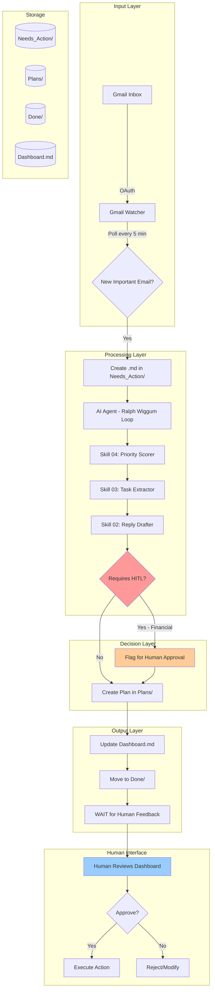

# AI Employee Vault - Bronze Tier Demo Guide

## Project Overview

The AI Employee Vault is an autonomous personal assistant system built for the "Personal AI Employee Hackathon 0 – Building Autonomous FTEs in 2026". This Bronze Tier implementation demonstrates a complete email processing pipeline where a Gmail Watcher monitors your inbox for important emails, creates structured markdown files in a Needs_Action folder, and an AI agent (Claude/Kiro) autonomously processes them using the Ralph Wiggum pattern (ACT → INFORM → WAIT). The system applies priority scoring, extracts tasks and deadlines, creates actionable plans, drafts replies, and flags sensitive operations (like financial transactions) for human-in-the-loop approval. All processing follows strict rules defined in Company_Handbook.md, maintaining transparency through Dashboard.md updates and ensuring security through OAuth authentication and approval workflows.

---

## Architecture Diagram



---

## Getting Started

### Prerequisites
- Python 3.13+ installed
- Gmail account with API access
- Google Cloud Project with Gmail API enabled
- `credentials.json` file in root directory

### Installation

1. **Clone and navigate to project:**
```bash
cd AI_Employee_Vault
```

2. **Install dependencies:**
```bash
pip install google-api-python-client google-auth-oauthlib google-auth-httplib2 watchdog python-dotenv playwright pyyaml
```

3. **Set up Gmail API credentials:**
   - Create a Google Cloud Project
   - Enable Gmail API
   - Download OAuth credentials as `credentials.json`
   - Place in project root directory

---

## Running the System

### Step 1: Start the Gmail Watcher

```bash
python Watchers/gmail_watcher.py
```

**What happens:**
- Browser opens for Gmail OAuth authentication (first run only)
- After authentication, creates `token.json` for future runs
- Polls Gmail every 5 minutes for unread + important emails
- Creates structured `.md` files in `Needs_Action/` folder
- Marks processed emails as read to avoid duplicates
- Prints timestamp on each polling cycle

**Output example:**
```
Gmail Watcher running Gmail check at 2026-03-18 16:15:11...
Found 2 new emails
Created email file: Needs_Action/email_20260318_161511_19d008ff.md
Created email file: Needs_Action/email_20260318_161512_19d00892.md
Gmail Watcher completed cycle, processed 2 emails
```

**To stop:** Press `Ctrl+C`

---

### Step 2: Start the AI Agent Processing Loop

**Option A: Process emails manually (recommended for testing)**
```bash
python Skills/email_processor.py
```

**Option B: Run full orchestrator (continuous loop)**
```bash
python orchestrator.py
```

**What happens:**
1. **ACT Phase:**
   - Scans all files in `Needs_Action/`
   - Applies priority scoring (HIGH/MEDIUM/LOW/IGNORE)
   - Extracts tasks, deadlines, and people mentioned
   - Creates action plans in `Plans/` folder
   - Drafts reply emails (if appropriate)
   - Flags financial transactions for HITL approval

2. **INFORM Phase:**
   - Updates `Dashboard.md` with processing summary
   - Logs recent activity
   - Updates task counts and statistics

3. **WAIT Phase:**
   - Moves processed emails to `Done/` folder
   - Awaits human feedback on flagged items
   - System ready for next cycle

**Output example:**
```
Starting email processing...
Found 5 emails to process
Created plan: Plans/Plan_19d008ff_Invoice_Payment.md
Processed: Needs_Action/email_20260318_161511_19d008ff.md
Email processing complete. Processed 5 emails.

<COMPLETE>
Email Processor skill completed. All emails from Needs_Action have been processed into Plans/ and moved to Done/. Dashboard updated.
</COMPLETE>
```

---

## How to Test the System

### Test Scenario: Send Yourself an Email

1. **Send a test email to your Gmail account:**
   - Subject: `URGENT: Payment Due $500`
   - Body: `Please process this payment by tomorrow. Invoice attached.`
   - Mark as important (star it)

2. **Wait for Gmail Watcher to detect it** (up to 5 minutes)

3. **Check `Needs_Action/` folder:**
   ```bash
   ls Needs_Action/
   ```
   You should see: `email_YYYYMMDD_HHMMSS_[gmail_id].md`

4. **Run the email processor:**
   ```bash
   python Skills/email_processor.py
   ```

5. **Check the results:**
   - `Plans/` folder: Contains action plan with HIGH priority
   - `Plans/` folder: Contains draft reply (REPLY_*.md)
   - `Done/` folder: Original email moved here with `<COMPLETE>` marker
   - `Dashboard.md`: Updated with processing summary

6. **Review the plan:**
   ```bash
   cat Plans/Plan_*_Payment*.md
   ```
   
   You'll see:
   - Priority: HIGH (due to URGENT + $500 + deadline)
   - HITL flag: YES (financial transaction)
   - Extracted tasks and deadlines
   - Risk assessment

---

## Understanding the Output

### Priority Scoring

The system assigns priorities based on keyword analysis:

- **HIGH**: Urgent keywords + financial amounts + deadlines + important sender
  - Example: "URGENT: Invoice $500 due tomorrow"
  
- **MEDIUM**: Standard requests, questions, updates
  - Example: "Can you send me the report?"
  
- **LOW**: Informational emails, order confirmations
  - Example: "Your order has shipped"
  
- **IGNORE**: Promotional emails, no-reply senders
  - Example: "Newsletter: Weekly deals"

### HITL (Human-In-The-Loop) Triggers

Per `Company_Handbook.md`, the following require human approval:

✅ **Auto-approve:**
- Information gathering
- File operations
- System maintenance
- Reading emails

⚠️ **Require approval:**
- Financial transactions
- Sensitive data access
- External communications
- Payment processing

🚨 **Emergency override:**
- Critical system failures (requires manual confirmation)

---

## Security & Privacy

### Authentication & Tokens

- **credentials.json**: OAuth client credentials (never commit to git)
- **token.json**: User access token (auto-generated, never share)
- Both files are in `.gitignore` by default

### OAuth Scopes

Current scope: `gmail.modify`
- Can read emails
- Can mark emails as read
- **Cannot send emails** (by design for Bronze Tier)
- **Cannot delete emails**

### Data Storage

- All email content stored locally in markdown files
- No external API calls except Gmail
- No sensitive data logged
- PII should be redacted in any shared examples

### HITL Protection

Financial operations are automatically flagged:
- Keywords: payment, invoice, $, €, £, amount, charge, fee
- Attachments: Any reply with attachments requires approval
- New recipients: CC/BCC additions require approval

**Example HITL flag:**
```yaml
requires_hitl: true
hitl_reason: "Financial transaction ($500) requires human approval per Company_Handbook.md"
```

---

## Folder Structure

```
AI_Employee_Vault/
├── Needs_Action/          # Incoming emails (processed by watcher)
├── Plans/                 # Action plans and draft replies
├── Done/                  # Processed emails with <COMPLETE> markers
├── Pending_Approval/      # Items awaiting human approval
├── Approved/              # Human-approved items
├── Inbox/                 # Manual input folder
├── Briefings/             # Context documents
├── Logs/                  # System logs
├── Archive_Feb16/         # Archived old emails
├── Skills/                # Agent skill definitions
│   ├── 01_EMAIL_PROCESSOR.md
│   ├── 02_EMAIL_REPLY_DRAFTER.md
│   ├── 03_TASK_EXTRACTOR.md
│   ├── 04_PRIORITY_SCORER.md
│   ├── 05_DASHBOARD_UPDATER.md
│   ├── 06_ARCHIVE_CLEANER.md
│   └── email_processor.py
├── Watchers/              # External system monitors
│   ├── gmail_watcher.py
│   └── base_watcher.py
├── Dashboard.md           # Live system status
├── Company_Handbook.md    # Rules of engagement
├── CLAUDE.md              # AI agent system prompt
├── README.md              # Project documentation
├── orchestrator.py        # Main coordination script
├── credentials.json       # Gmail API credentials (not in repo)
├── token.json             # OAuth token (auto-generated)
└── pyproject.toml         # Python dependencies
```

---

## Monitoring the System

### Check Dashboard Status

```bash
cat Dashboard.md
```

Shows:
- Active tasks count
- Completed today count
- Items in each folder
- Recent activity log
- System status

### Check Pending Approvals

```bash
ls Plans/ | grep REPLY
```

Draft replies requiring approval will have `REPLY_` prefix.

### Check Logs

```bash
ls Logs/
```

System logs and cleanup reports stored here.

---

## Troubleshooting

### Gmail Watcher Not Finding Emails

**Problem:** Watcher runs but doesn't create files

**Solutions:**
1. Check Gmail query: `is:unread (is:starred OR is:important) -in:sent`
2. Verify emails are either:
   - Manually starred (yellow star icon), OR
   - Marked important by Gmail (yellow arrow icon)
3. Check if emails are older than 24 hours (query limit)
4. Ensure OAuth token is valid (delete `token.json` and re-authenticate)
5. Make sure email is still unread in Gmail

### Email Processor Fails

**Problem:** `python Skills/email_processor.py` crashes

**Solutions:**
1. Check PyYAML is installed: `pip install pyyaml`
2. Verify email files have valid YAML frontmatter
3. Check file permissions on Needs_Action/ and Plans/ folders

### Priority Scoring Incorrect

**Problem:** Email gets wrong priority

**Solutions:**
1. Review `Skills/04_PRIORITY_SCORER.md` keyword lists
2. Check email content for urgency indicators
3. Verify sender importance scoring
4. Manually adjust priority in email frontmatter if needed

---

## Lessons Learned

### What Worked Well

✅ **Structured Markdown Files**: Using YAML frontmatter + markdown body provides both machine-readable metadata and human-readable content

✅ **Ralph Wiggum Pattern**: ACT → INFORM → WAIT creates clear autonomy boundaries with human oversight

✅ **Priority Scoring**: Keyword-based scoring effectively identifies urgent items without complex ML

✅ **HITL Flags**: Automatic detection of financial keywords prevents unauthorized transactions

✅ **Folder-Based Workflow**: Simple file movement (Needs_Action → Plans → Done) creates clear processing pipeline

### Challenges Encountered

⚠️ **HTML Email Content**: Many promotional emails contain raw HTML, making content extraction difficult

⚠️ **Gmail Query Limitations**: 24-hour lookback window means older emails aren't processed

⚠️ **No Email Sending**: Bronze Tier can draft replies but cannot send them (requires human copy-paste)

⚠️ **Manual Loop Execution**: Email processor must be run manually; no automatic trigger on new emails

⚠️ **Limited Context**: Each email processed independently; no conversation threading or history

### Key Insights

💡 **Autonomy Requires Constraints**: HITL approval for financial operations builds trust

💡 **Transparency is Critical**: Dashboard updates and activity logs make AI decisions auditable

💡 **Simple > Complex**: File-based architecture easier to debug than database

💡 **Security First**: OAuth scopes limited to read+modify (not send) prevents accidental email sending

💡 **Markdown is Universal**: Both humans and AI can read/write markdown effectively

---

## Future Enhancements (Silver/Gold Tier)

### Silver Tier Roadmap

🚀 **WhatsApp Watcher**
- Monitor WhatsApp Business API for messages
- Create structured message files in Needs_Action/
- Support multimedia (images, voice notes)
- Integration: `Watchers/whatsapp_watcher.py`

🚀 **MCP Email Sender**
- Model Context Protocol integration for sending emails
- Draft approval workflow in Pending_Approval/
- Human clicks "Approve" → MCP sends email
- Audit trail in Logs/

🚀 **Automatic Loop Trigger**
- File system watcher on Needs_Action/ folder
- Auto-run email processor when new files appear
- Continuous operation without manual intervention

🚀 **Conversation Threading**
- Track email threads using thread_id
- Maintain conversation context
- Reference previous messages in replies

### Gold Tier Vision

🌟 **Multi-Channel Integration**
- Slack, Discord, Telegram watchers
- Unified inbox across all channels
- Channel-specific reply formatting

🌟 **Advanced NLP**
- Sentiment analysis for priority scoring
- Entity extraction (names, dates, amounts)
- Intent classification (request, question, complaint)

🌟 **Calendar Integration**
- Extract meeting requests automatically
- Create calendar events from deadlines
- Send meeting confirmations

🌟 **Payment Processing**
- Stripe/PayPal integration with HITL approval
- Invoice generation and sending
- Payment tracking and reconciliation

🌟 **Learning & Adaptation**
- Track human approval/rejection patterns
- Adjust priority scoring based on feedback
- Personalized urgency detection

### Platinum Tier Dream

💎 **Full Autonomy with Guardrails**
- Multi-step task execution
- External API integrations (CRM, project management)
- Proactive suggestions based on patterns
- Voice interface for approvals
- Mobile app for on-the-go management

💎 **Team Collaboration**
- Multi-user support with role-based access
- Shared inbox and task delegation
- Team dashboard and analytics
- Collaborative approval workflows

---

## Contributing

This is a hackathon project demonstrating Bronze Tier capabilities. To extend:

1. **Add New Watchers**: Create new watcher in `Watchers/` inheriting from `BaseWatcher`
2. **Add New Skills**: Create skill definition in `Skills/` with YAML frontmatter
3. **Extend Priority Scoring**: Add keywords to `Skills/04_PRIORITY_SCORER.md`
4. **Add HITL Rules**: Update `Company_Handbook.md` authorization thresholds

---

## License

MIT License - See LICENSE file for details

---

## Acknowledgments

Built for **Personal AI Employee Hackathon 0 – Building Autonomous FTEs in 2026**

**Bronze Tier Achievement Unlocked** ✅
- Folder structure ✓
- Core markdown files ✓
- Python project + dependencies ✓
- Gmail Watcher running ✓
- Agent skills created ✓
- Ralph Wiggum loop functional ✓

---

**Demo Guide Version:** 1.0  
**Last Updated:** March 18, 2026  
**Status:** Bronze Tier Complete - Ready for Silver Tier Development

---

## Quick Reference Commands

```bash
# Start Gmail Watcher
python Watchers/gmail_watcher.py

# Process emails manually
python Skills/email_processor.py

# Run full orchestrator
python orchestrator.py

# Check dashboard
cat Dashboard.md

# List pending items
ls Needs_Action/

# List plans
ls Plans/

# List completed items
ls Done/

# Check for HITL approvals
ls Plans/ | grep REPLY
```

---

**Ready to deploy your autonomous AI employee!** 🚀
